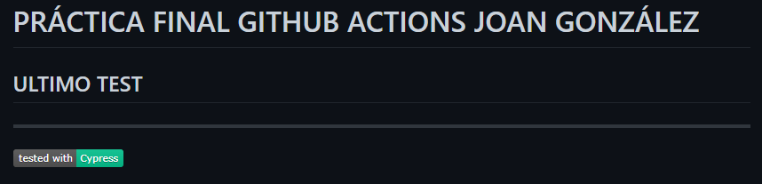

# PRÁCTICA FINAL GITHUB ACTIONS JOAN GONZÁLEZ

## ULTIMO TEST

<hr>

[](https://www.cypress.io/)

## Linter_job

Para crear el job de linter tendremos que crear dentro de la carpeta `.gihtub/workflows` un fichero yml con el nombre de nuestro repositorio `practica_github_actions_workflow.yml` que ejecutara `linter` 

````yml
linter_job:
  runs-on: ubuntu-latest
  steps:
    - name: Checkout lint
      uses: actions/checkout@v2
    - run: npm install
    - run: npm run lint
````

### Al hacer un commit desde la rama `main` se ejecutara el workflow, al hacerlo nos dara un error en el codigo:


### Corregimos los errores y volvemos ha hacer el push


Como podemos ver a funcionado perfectamente.

<hr>

## Cypress_job

Se encargará de ejecutar los tests de cypress (link) que contiene el proyecto. Para ello, utilizaréis la action oficial del proyecto (link). Si lo deseáis, podéis ejecutar manualmente mediante el comando npm run cypress (siempre que esté arrancado el proyecto previamente). Este job, que se ejecutará después del Linter_job, estará compuesto por los siguientes steps:
 - El encargado de realizar el checkout del código
 - El encargado de ejecutar los tests de cypress que continuará aunque se produzca un error (existe una propiedad que podéis establecer para conseguir este comportamiento)
 - El encargado de crear un artefacto (result.txt) que contendrá la salida del step anterior

### A continuación de `linter_job` crearemos el `cypress_job`

````yml
cypress_job:
  runs-on: ubuntu-latest
  needs: linter_job
  steps:
    - name: Checkout 
      uses: actions/checkout@v3
    - name: Cypress Run
      uses: cypress-io/github-action@v5
      with:
        config-file: cypress.json
        build: npm run build
        start: npm start
      continue-on-error: true
      id: cypressTests
    - name: Resultado en - result.txt
      run: echo ${{ steps.cypressTests.outcome }} > result.txt
    - name: Upload Artifact Result
      uses: actions/upload-artifact@v3
      with:
        name: test_result
        path: result.txt
````

### Al hacer un push podremos ver como ha ejecutado los dos jobs perfectamente


<hr>

## Add_badge_job

Add_badge_job. Se encargará de publicar en el readme del proyecto el badge que indicará si se han superado los tests de cypress o no. Estará compuesto por los siguientes steps:
 - El encargado de realizar el checkout del código
 - El encargado de obtener los artefactos almacenados en el job anterior
 - Un step encargado de generar un output partiendo de la lectura del artefacto recuperado. Básicamente ejecutará la instrucción echo "::set-output name=cypress_outcome::$(cat result.txt)"
 - Un step que ejecutará una action propia que deberéis crear. Esta action recibirá como parámetro de entrada el output generado por el step anterior y, dependiendo de si es “failure” o “success”, modificará el README.md del proyecto añadiendo uno de los siguientes badges al final del mismo y tras el texto “RESULTADO DE LOS ÚLTIMOS TESTS”:
    - (Failure) https://img.shields.io/badge/test-failure-red
    - (Success) https://img.shields.io/badge/tested%20with-Cypress-04C38E.svg
Step encargado de publicar el cambio del README.md en el repositorio

### Primero crearemos el action para actualizar el `README`

Crearemos la carpeta `.github/actions/actualizar_readme` donde crearemos un proyecto en node 

````js
const core = require("@actions/core")
const fs = require("fs")

const info = core.getInput("result")

const success = "https://img.shields.io/badge/tested%20with-Cypress-04C38E.svg"
const failure = "https://img.shields.io/badge/test-failure-red"

let result = info == 'success' ? success : failure

let readme = "./README.md"

fs.readFile(readme, "utf8", (err, data) => {

    if (err) throw err;

    if (data.indexOf(`(${success})`) != -1) {
        data = data.replace(`(${success})`, `(${result})`)
    }

    if (data.indexOf(`(${failure})`) != -1) {
        data = data.replace(`(${failure})`, `(${result})`)
    }

    fs.writeFile(readme, data, (err) => {
        if (err) throw err;

        process.exit(0)
    })

})
````

Una vez creado el index.js tendremos que compilar utilizando `vercel` y en el `package.json` crearemos un scrpit que ejecutara el comando `ncc build index.js`

````json
"scripts": {
  "test": "echo \"Error: no test specified\" && exit 1",
  "build": "ncc build index.js"
},
````

Y compilaremos

En esta misma carpeta crearemos el fichero `action.yml`

````yml
name: Update Readme Actions
description: Takes the result of the tests and updates the readme adding an badge
inputs:
  result:
    description: Gets the result of Cypress
    required: true
runs:
  using: "node16"
  main: "dist/index.js"
````
Y por ultimo crearemos el job en el `workflow`

````yml
badge_job:
  runs-on: ubuntu-latest
  needs: cypress_job
  steps:
    - name: Checkout
      uses: actions/checkout@v3
    - name: Get Result from Artifact
      uses: actions/download-artifact@v3
      with:
        name: test_result
    - name: Get Result Value
      run: echo "::set-output name=cypress_outcome::$(cat result.txt)"
      id: result_cypress_tests
    - name: Update Readme
      uses: "./.github/actions/actualizar_readme"
      with:
        result: ${{ steps.result_cypress_tests.outputs.cypress_outcome }}
    - name: Commit Readme Changes
      uses: EndBug/add-and-commit@v9
      with:
        add: "."
        author_name: ${{ github.event.pusher.name }}
        autho_email: ${{ github.event.pusher.email }}
        message: "Result of the tests on Cypress"
        push: true
````

Para que funcione hay que dar parmisos de lectura y escritura al workflow

Accedermos a `Settings > Actions > General` y activamos los permisos


Una vez damos los permisos y hacemos el push podremos ver los resultados.


Success:



Failed:


<hr>

## Deploy_job

Utilizando la action amondnet/vercel-action@v20, se encargará de publicar el proyecto en la plataforma vercel. Se ejecutará tras el Cypress_job y estará formado por dos steps:
 - El encargado de realizar el checkout del código
 - El encargado de desplegar la aplicación en vercel que utilizará la action amondnet/vercel-action@v20

Le primer paso sera crear una cuenta en `vercel` con `github` y importamos el proyecto


A continuación pulsaremos en `Deploy` y nos aparecera la siguiente tarjeta el sitio web es el siguiente <a href="https://practica-github-actions-en6a3xytb-joangoal.vercel.app">practica-github-actions</a>


A continuación crearemos el job en el workflow

````yml
deploy_job:
  runs-on: ubuntu-latest
  needs: cypress_job
  steps:
    - name: Checkout
      uses: actions/checkout@v3
    - name: Upload to Vercel
      uses: amondnet/vercel-action@v20
      with:
        vercel-token: ${{ secrets.VERCEL_TOKEN }}
        vercel-org-id: ${{ secrets.VERCEL_ORG_ID }}
        vercel-project-id: ${{ secrets.VERCEL_PROJECT_ID }}
        working-directory: ./
````

Para que la informaciónm sea mas segura utilizaremos los secrets de `github`


Una vez creados los secrets hacemos un push

Para ver que funciona hare unos cambios en el proyecto de next


